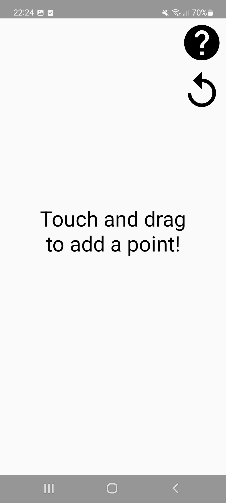
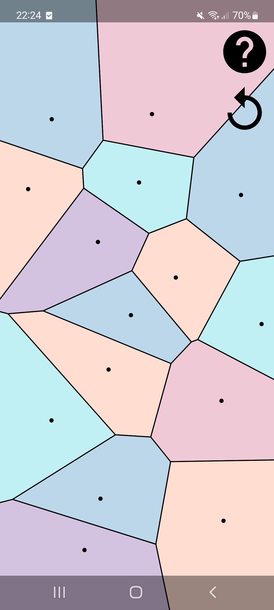
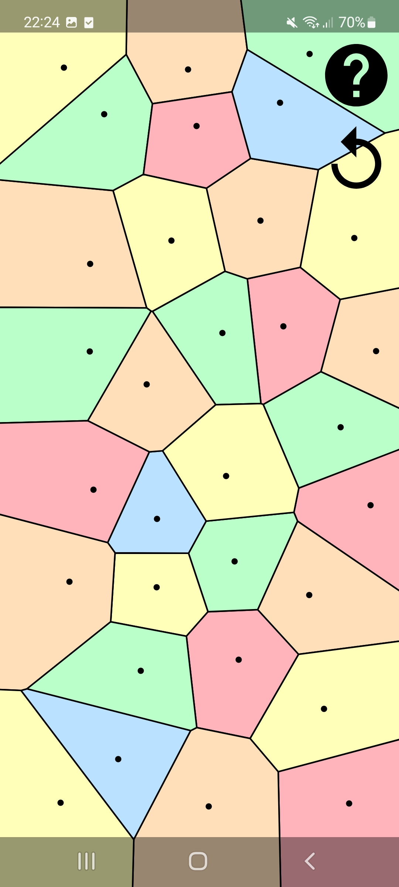
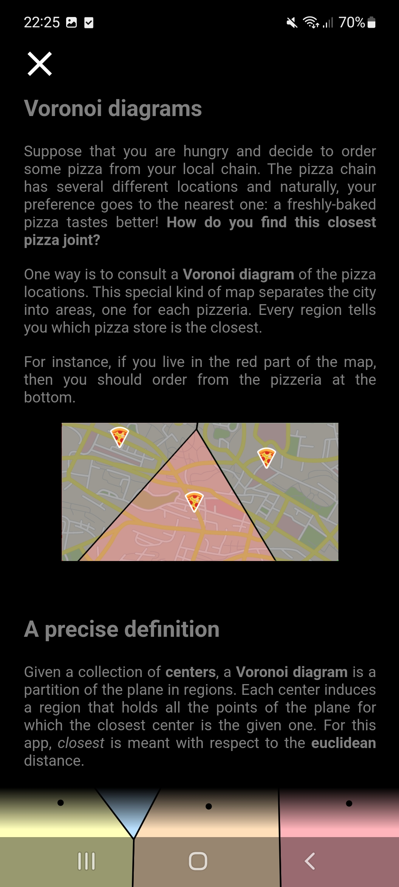

# VoroDraw

A simple Android App to interact with [Voronoi diagrams](https://en.wikipedia.org/wiki/Voronoi_diagram) in an interactive manner. Move your finger and observe the optimal partition evolve in real time! 

## How to run
Since 2024, the app is no longer featured on Google playstore (that was too much work to maintain). Still, you can get the APK directly from this repo and run it on your phone.

## Sample screenshots

